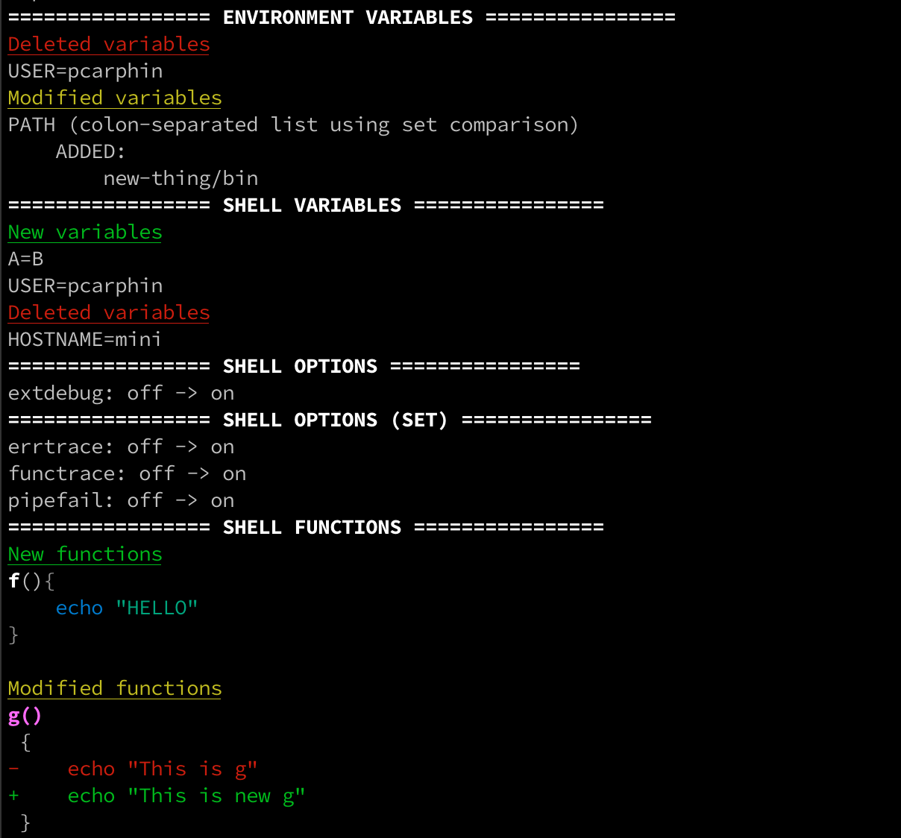

# Complete BASH shell environment comparison tool

```
env-diff [options] [--] CMD

Produce a complete summary of what `CMD` has changed in the enivironment.
- Environment variables
- Shell variables
- Associative arrays
- Normal arrays
- Shell options (shopt and set)
- Functions
```

`CMD` can be any command although running executables will have no effect on the environment so it will be either `source` command or a call to a shell function but it can also be plain shell code.

# Installing

Clone this repository and source `env-diff-cmd.bash` from the repo in your
`~/.bashrc`.

You can also copy the `dot-config-env-diff.yml` to `$HOME/.config/env-diff.yml`
or make your own using the file as a template.

# Usage

Sourcing `env-diff-cmd.bash` defines the `env-diff()` shell function which can receive
any BASH code as an argument (calling a shell function, defining variables or other stuff,
sourcing a script)

```
env-diff 'f(){ echo "HELLO" ; }
    PATH=new-thing/bin:${PATH}
    A=B
    set -o pipefail
    shopt -s extdebug
    g(){ echo "This is new g" ; }
    unset HOSTNAME
    export -n USER'
```



# Details

[manpage](env-diff.org)
